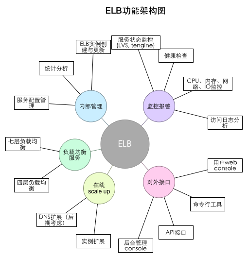
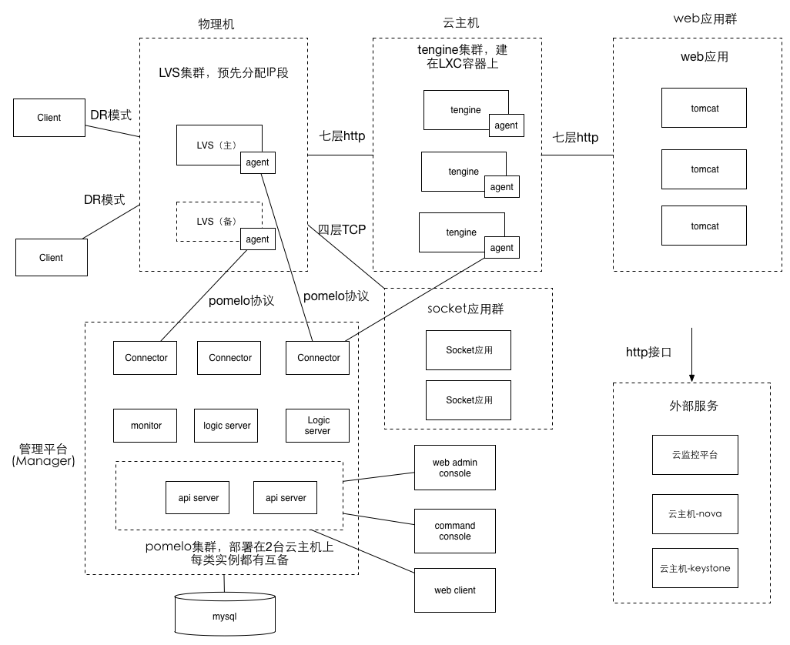

# elb部署架构

## 1. 系统说明

ELB是负载均衡服务，位于整个网易私有云的Pass服务层，构建于云主机这个IAAS服务之上，提供四层与七层的负载均衡服务。是云应用服务的基础。

* 四层负载均衡：基于TCP协议的负载均衡服务。主要用于非web的网络应用服务
* 七层负载均衡：基于HTTP协议的负载均衡服务。主要用于基于web的应用服务

由于LVS的特殊性， LBS还有一部分服务架构在物理机上。

* 云主机(NVS)， 提供tengine所在服务器所需的资源， 作为tengine服务的载体。
* 物理机，提供LVS所在服务器所需的资源，作为LVS服务的载体。

ELB主要用于解决服务器负载均衡资源利用率低、配置复杂、运维自动化程度高、服务可用性难以保证、无法自动scale up等问题，基本功能如图所示：

## 2. 部署架构图

ELB的系统架构以及与其他模块交互的架构图如图如示：

## 3. 架构说明

### 3.1 进程模块说明

上述架构图中主要展示了 ELB 系统的主要功能组件、外部依赖服务、进程之间通信协
议,端口、数据流向,具体介绍如下。

#### 3.1.1 Manager集群


功能用途：

* 负责elb的建立，删除等操作的调度
* 负责接收集群上各个agent的连接,接收agent的监控数据并处理
* 负责向各个agent发送操作指令
* 负责api请求的服务， 接收web admin console, 命令行工具，web client的api请求
* 负责监控信息的统计与收集， 并向监控平台推送报警信息

服务接口：

* connector， 与agent连接，采用pomelo协议，服务端口号3010
* api server， 与各个client相连， 采用http协议，端口号8081, 使用域名

部署方式：

* Manager是基于pomelo搭建的服务器集群，本身是多进程架构， 通过部署在多台服务器上可以达到高可用。

#### 3.1.2 agent进程

功能用途：

* 负责收集LVS与tengine上的监控信息， 并送给manager
* 如果发现异常情况，agent会直接向运维平台报警
* 负责接收manager的命令， 进行相关的运维操作

服务接口：

无， 由agent主动去连manager，本身不提供接口。保证agent的安全性。

部署方式：

* 对于tengine, 部署在云主机内部， 每个云主机有且仅有一个agent
* 在发布版本制作云主机快照时,打进快照内部。在虚拟机启动后,由 crontab 定期 执行一个脚本,判断 Agent 进程是否存在,如果不存在,则启动一个新的 Agent 进
程,实现 Agent 自启动。
* 对于LVS， 则需要预先部署在物理机

### 3.2 进程间的依赖关系说明

#### 3.2.1 Agent进程 -> Manager

* 连接: Agent在自启动以后会自连接Manager，连接断开后会定时重连
* 调用时机
	* Agent上报监控数据到Manager
	* 发运维指令，如创建、更新ELB时，由Manager推送指令到Agent
	* Agent需要自更新、或Agent需要推送脚本时
* 通信协议： pomelo的客户端连服务协议， 基于TCP
* 负载均衡：Agent进程在客户端缓存多个ip地址， 随机挑选其中的一个连接，如果不通会将该ip暂时屏蔽，在剩下的ip中挑选可用的ip
* 扩展方式：connector无状态，可水平扩展
* 高可用机制：
 * connector有多台，部署在不同的服务器。
 * agent要支持连接断开后定时重连（libpomelo支持）。
 * 通过操作系统的 crontab 定期检查 Agent 进程是否存在,如果不存在,则立即启动一个新的 Agent 进程,保证 Agent 自启动。
* 安全保障：ip白名单

#### 3.2.2 外部用户 -> ELB（实际是LVS进程）

* 调用时机：客户端向服务器应用发请求，都要先经过ELB负载均衡。LVS的ip段事先分好，建好一个ELB就给它分配一个固定的ip。
* 通信协议：四层的话是TCP, 七层的话是http。LVS的连接采用DR模式， 因此只有client上行发请求需要经过LVS，下行请求不经过LVS
* 负载均衡：无，有主备
* 扩展方式: 目前LVS实例不能扩展
* 高可用保证：LVS主备
* 安全保障：无

#### 3.2.3 LVS -> tengine（七层）

* 调用时机： 客户端的http请求转发到tengine
* 通信协议: http
* 负载均衡：根据ELB配置的策略确定， 默认是RR，可以支持session sticky
* 扩展方式：tegine实例在负载过高时可以动态添加，LVS通过ipvsadm命令动态添加配置。tengine可以通过增加云主机扩展。 scale up的频率参考aws， 每5分钟增加20%
* 高可用保证：tengine启动多个实例，无状态
* 安全保障：ip白名单

#### 3.2.4 tengine -> 后端web应用，一般为tomcat容器（七层）

* 调用时机：tengine的http请求转发到后端web应用
* 通信协议： http
* 负载均衡: 根据tengine配置，默认支持RR和session sticky
* 扩展方式：添加tomcat实例需要修改tengine配置，并reload服务，不影响线上服务。
* 高可用保证: 多台tomcat，无状态
* 安全保障：由用户自己根据应用需要解决
* 超时：由tengine配置，可由用户配置

#### 3.2.5 LVS -> 后端socket应用（四层）

* 调用时机： 客户端的tcp请求转发到后端的socket应用
* 通信协议: TCP
* 负载均衡：根据ELB配置策略确定，默认为RR
* 扩展方式：后端Socket应用可以动态扩展，LVS通过ipvadm命令动态添加
* 高可用保证：启动多实例，无状态
* 安全保障: 由用户应用解决

#### 3.2.6 管理员服务 -> Manager的api server

* 调用时机： 管理员通过命令行工具、admin console或者api请求发管理命令
* 通信协议：http
* 负载均衡：前端可能会架nginx， 通过域名访问
* 扩展方式: 静态配好多台， 不会自动扩展
* 高可用保证：多台api server， 部署在不同云主机 
* 安全保障：暂时只用ip白名单

### 3.3 外部服务说明

#### 3.3.1 云主机服务-KeyStone

* 用途:根据提供的用户名、密码和用户 ID,生成访问云主机服务所需的 token。 服务地址:http://10.120.202.202:35357
* 访问方式:Http 请求,同步方式,长连接,连接池:50,连接超时时间 50 秒,支持自动重 连,最大重连次数 3 次。
* 安全保障机制:限内网用户 
* 配额限制:无

#### 3.3.2 云主机服务-nova

* 用途:作为 tengine 的载体,每个云主机上都单独部署一个 MySQL 实例,Nova 服务负责管理所有的虚拟机,提供创建、删除、Resize、查询云主机,申请、挂载、卸载、释放浮动 IP, 检查云主机的操作系统是否完全启动,获取云主机的规格列表等接口。
* 服务地址:http://10.120.202.202:8774
* 访问方式:Http 请求,同步方式,长连接,连接池:50,连接超时时间 50 秒,支持自动重连,最大重连次数 3 次。
* 安全保障机制:需要 token 认证。
* 配额限制:云主机配额(台):1000、云主机 CPU 配额(个):1000、ECU 配额(个):1000、 内网浮动 IP 配额(个):200、外网浮动 IP 配额(个):30、内存容量配额(GB):5000

### 3.3.3 云监控服务

* 用途：收集ELB的监控信息与报警信息，显示监控信息， 并根据条件报警
* 服务地址：10.120.144.205:8181
* 访问方式: http请求, 同步方式，连接池：50， 连接超时时间：50 秒，支持自动重连
* 安全保障机制： ip白名单
* 配额限制：无

## 4. 关键业务流程说明

### 4.1 创建ELB

### 4.2 修改ELB

## 5. 进程配置说明

### 5.1 运维脚本说明

### 5.2 配置文件说明

## 6. 监控报警机制

### 6.1 LVS

### 6.2 Tengine

### 6.3 Manager

### 6.4 Agent

### 6.5 其他

## 7. 故障处理机制
## 8. 风险控制

## 9. API接口

## 10. 命令行接口

## 11. 统计分析说明

